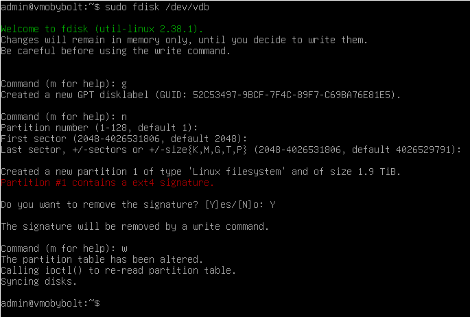

<!-- markdownlint-disable MD014 MD022 MD025 MD033 MD040 -->

# Migrate Docker data
{: .no_toc}

You can take advantage of this guide in the following situations:

1. you have already installed MobyBolt on a single disk and want to migrate to the configuration with a separate storage for Docker data;
2. you want to replace the disk for Docker data that is already on your system.

{: .hint}
If you are in case 2 and want to replace an internal drive, you can temporarily connect the new drive via USB3, complete the steps in this guide, and then replace the disk in the internal slot.

---

## Table of contents
{: .no_toc .text-delta}

1. TOC
{:toc}

---

## Identify the new disk

Run the following command (with **example** output):

```sh
$ lsblk -o NAME,MOUNTPOINT,UUID,FSTYPE,SIZE,LABEL,MODEL
> NAME   MOUNTPOINT UUID                                 FSTYPE  SIZE LABEL MODEL
> sda                                                             20G       CYX-SSD-S1000
> ├─sda1 /boot/efi  ED3D-37B3                            vfat    512M       
> ├─sda2 /          b6649e30-d00b-4fd8-8ce0-b85be4c3075b ext4   18.5G       
> └─sda3 [SWAP]     b39d91f1-065d-41fd-be35-cbd96ac1ff3a swap    976M       
> sdb                                                            1.9T       SPCC Solid State Disk
```

Here we will see if the new disk has been detected by the system and what unit name has been assigned to it. Normally `sda` is the name assigned for the primary disk, `sdb` for the secondary disk, and so on, but your case could be different, pay attention to the `NAME`, `SIZE` and `MODEL` columns to identify each one, e.g: "sdb, 1.9T, SPCC Solid State Disk".

For each disk present, also pay attention to the `MOUNT POINT` column (any partitions of the disk you are looking for will not have any `MOUNT POINT` associated with them)

---

## Check drive performance

A performant SATA/USB3 unit storage is essential for your node.

Install `hdparm`:

```sh
$ sudo apt install -y hdparm
```

Let's check if your drive works well as-is:

```sh
$ sudo hdparm -t --direct /dev/<YOUR_DRIVE>
> Timing O_DIRECT disk reads: 932 MB in  3.00 seconds = 310.23 MB/sec
```

{: .warning}
Remember to replace `<YOUR_DRIVE>` with your device, detected during the previous step.

{: .note}
If the measured speeds are more than 150 MB/s, you're good but it is recommended more for a better experience.

---

## Create a new partition

{: .warning}
This will erase any data that may be on the disk!

Type this command to use the `fdisk` utility and manage the secondary disk:

```sh
$ sudo fdisk /dev/<YOUR_DRIVE>
```

{: .warning}
Remember to replace `<YOUR_DRIVE>` with your device, detected during the previous step.

You will be in the fdisk prompt, where you'll need to follow the next steps:

1. Type `g` and `enter/return` key in order to create a new GPT Partition Table.

2. Type `n` in order to create a new primary partition, and then press `enter/return` key until the prompt shows you: `Created a new partition X of type 'Linux filesystem'`.

3. Type `w` and `enter/return` key in order to save the configuration and exit.

{: .hint}
If you have pre-existing partitions, you may encounter a message like: `Partition X contains a Y signature. Do you want to remove the signature? [Y]es/[N]o`. In this case, type `y` and press `enter/return` key until the prompt shows you: `The signature will be removed by a write command`.

This will create a new partition called probably `sdb1`.



Finally, format the new partition to `Ext4` and obtain the `UUID`:

```sh
$ sudo mkfs.ext4 /dev/<YOUR_PARTITION>
```

{: .warning}
Remember to replace `<YOUR_PARTITION>` with your partition, created during the previous step.

The output will look similar to the following as an example:

```sh
> mke2fs 1.47.0 (5-Feb-2023)
> Discarding device blocks: done                            
> Creating filesystem with 503315968 4k blocks and 125829120 inodes
> Filesystem UUID: 774987cd-7827-47b2-813e-6fdb2692a182
> ...
```

**Take note of the `Filesystem UUID`**

---

## Migrate Docker data

If you have Docker data to migrate, you can follow the next steps:

1. Temporary mount the new partition:
   
   ```sh
   $ sudo mount -m /dev/<YOUR_PARTITION> /mnt
   ```
   
   {: .warning}
   Remember to replace `<YOUR_PARTITION>` with your partition, created during the previous step.

2. Shutdown docker:
    
   ```sh
   $ sudo systemctl stop docker docker.socket
   ```

3. Install rsync:

   ```sh
   $ sudo apt install -y rsync
   ```

4. Copy Docker data:

   ```sh
   $ sudo rsync -av /var/lib/docker/ /mnt/
   ```

   {: .warning}
   If you have a lot of data to transfer (e.g. blockchain) this can take a long time.

---

## Set the new mount point

Edit the `fstab` file and add the following line at the end, replacing `<YOUR_UUID>` with your own `UUID`:

```sh
$ sudo nano /etc/fstab
```

```sh
UUID=<your_UUID> /var/lib/docker ext4 defaults,noatime 0 2
```

{: .warning}
If you are replacing the disk, remove the line for the old disk in fstab (the one containing the `/var/lib/docker` mount point)

---

## Reboot

```sh
$ sudo reboot
```
