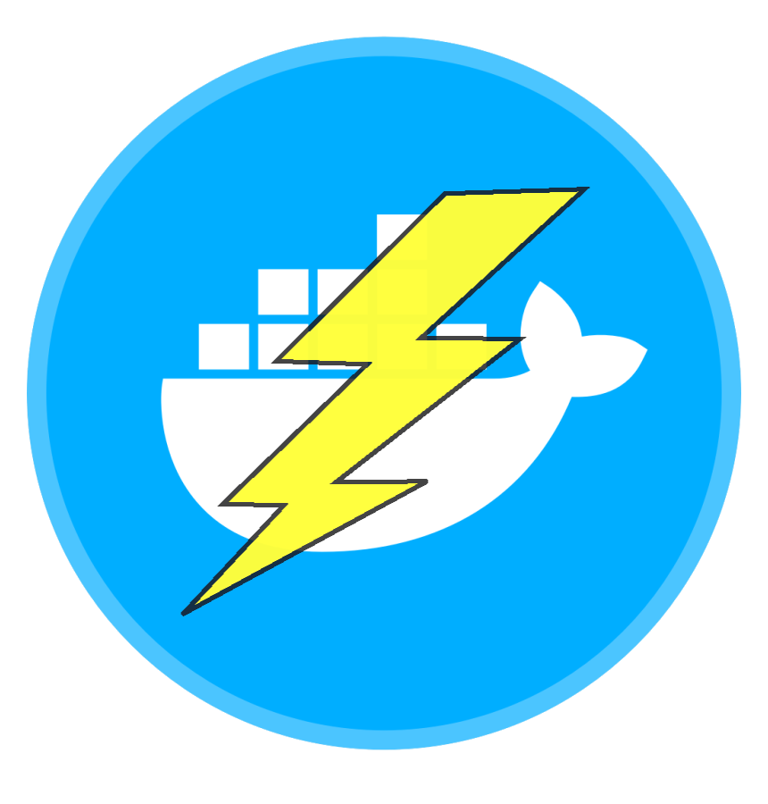

{: .logo }

Build your own "do-everything-yourself" Bitcoin full node that will make you a sovereign peer in the Bitcoin and Lightning network.
{: .fs-6 }

No need to trust anyone else.
{: .fs-6 }

---

## Table of contents
{: .no_toc .text-delta}

1. TOC
{:toc}

---

## Overview

A Bitcoin & Lightning node is a complex ecosystem of applications and services. These applications, often interconnected with each other, must be able to provide their services safely and without exposing sensitive data, such as the IP address of the machine on which they run, to the outside. 

Security and privacy are a theme that will accompany this entire guide and we believe that the setup proposed here, which has the use of Docker at its center, is an excellent compromise between usability, security and privacy.

---

## Structure

The MobyBolt guide is divided into three main categories:

1. **[Setup](setup)**: setup of basic services.
2. **[Bitcoin](bitcoin)**: setup of Bitcoin-related services (Layer 1)
3. **[Lightning](lightning)**, setup of Lightning-related services (Layer 2)

Below is the map of the services that we are going to install in the various categories:

|**Service**|**Category**|
|:---|:---|
|**[nginx](setup/reverse-proxy)**|setup|
|**[tor](setup/tor-project)**|setup|
|**[i2p](setup/i2p-project)**|setup|
|**[bitcoin client](bitcoin/bitcoin-knots)**|bitcoin|
|**[electrum server](bitcoin/fulcrum)**|bitcoin|
|**[blockchain explorer](bitcoin/btcrpcexplorer)**|bitcoin|
|**[lightning client](lightning/lnd)**|lightning|
|**[lightning webapp](lightning/thunderhub)**|lightning|

For each service, we will explain the installation and upgrade procedures.

For the sake of completeness, we will also present the procedures for uninstalling each service. However, it must be considered that, since many services are strongly interconnected, uninstalling one of them could compromise many others.
For example, virtually all other applications require a bitcoin client, and uninstalling this would make them unusable.
However, the procedure for uninstalling the bitcoin client could be used to replace a specific implementation of it (e.g. Bitcoin Core) with another (e.g. Bitcoin Knots).

Below is a map of the direct/strong dependencies of each service:
- horizontally you will find out which other services does each service depend on (e.g. `electrum server` depends on `bitcoin client`, which in turn depends on `tor` and `i2p`);
- vertically you will find out which other services each service is required by (e.g. `electrum server` is required by `blockchain explorer`).

||**nginx**|**tor**|**i2p**|**bitcoin client**|**electrum server**|**blockchain explorer**|**lightning client**|**lightning webapp**|
|:---|:---|:---|:---|:---|:---|:---|:---|:---|
|**nginx**|||||||||
|**tor**|||||||||
|**i2p**|||||||||
|**bitcoin client**||D|D||||||
|**electrum server**||||D|||||
|**blockchain explorer**||||D|D||||
|**lightning client**||||D|||||
|**lightning webapp**|||||||D||

---

## Security and privacy aspects
### Container isolation

Each application will be jailed in a container and will therefore run in a **protected and isolated environment**, only with what is strictly necessary to provide its service and nothing more.

In addition, each container will run as a different **non-root user**, which is ideal for protecting other containers on the same network and the host itself.

### Network isolation

The isolation of containers is also in terms of **network**: two containers will not be able to communicate with each other unless they are part of the same network.

{:.note}
For each defined network, Docker will automatically manage NAT, firewall and port forwarding.

Docker allows you to create networks of the following types:

- **external**: 
  - for services that require external visibility
  - these services will be able to reach from the outside
  - these services will be able to be reached from the outside exposing a port

- **internal**:
  - for services that do not require external connectivity
  - these services won't be able to directly reach or be reached from the outside
  - these services will still be able to reach and be reached from the outside through another service (e.g. nginx, tor...) attested on an external network and on their own internal network

{:.more}
[Networking in Docker](https://docs.docker.com/engine/network/){:.target="_blank"}

MobyBolt will create the following networks:

**Name**|**Type**|**Addressing**|**Subnet**|**Gateway**|
:---:|:---:|:---:|:---:|:---:
**backend**|internal|static|172.16.21.0-127||
**frontend**|external|dynamic|172.16.21.128-255|172.16.21.129|

{:.note}
>A **static addressing** (generally not necessary, since services can be invoked by name) will be used for the **backend internal network**. In fact:
>- if you wanted to implement the (optional) configuration in Bitcoin Knots/Core to reject non-private networks, name resolution would be disabled and you could only reach the other containers via the IP address (which will therefore have to be static);
>- with a dynamic addressing, we could have problems with nginx and tor, which will be the only access points from the outside to all the services. If we wanted to temporarily disable a non-mandatory service (e.g. BTC RPC Explorer) nginx and tor would no longer be able to resolve its name and would fail.

MobyBolt applications will be attested to networks as follows:

||**frontend**|**backend**|
:---:|:---:|:---:
| **nginx**|&#10004;|&#10004;|
| **tor**|&#10004;|&#10004;|
| **i2p**|&#10004;|&#10004;|
|**bitcoin client**||&#10004;|
|**electrum server**||&#10004;|
|**blockchain explorer**||&#10004;|
|**lightning client**||&#10004;|
|**lightning webapp**|&#10004;|&#10004;|

---

{: .d-flex .flex-justify-between}
[<< Docker](../system/docker)
[Project setup >>](./setup/project-setup)
