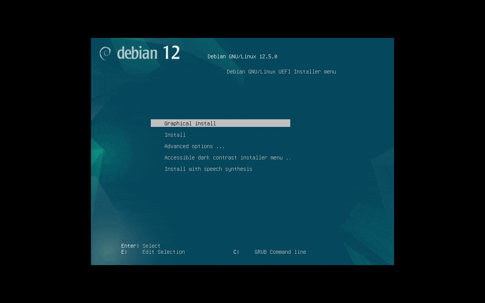

<!-- markdownlint-disable MD014 MD022 MD025 MD033 MD040 -->

# Operating System
{: .no_toc }

We configure the personal computer and install the Linux operating system.

---

## Table of contents
{: .no_toc .text-delta }

1. TOC
{:toc}

---

## Which operating system to use?

We use the latest stable [Debian](https://www.debian.org/) release (currently **Debian 12 - Bookworm**), without a graphical user interface. This provides the best stability for the PC and makes the initial setup a breeze.

---

## Prepare the installation media

From your regular PC, direct download Debian by going to the [official website](https://www.debian.org/) and clicking on the `Download` button.

### Prepare the installation media on Linux

Open a terminal and point it to the directory where you downloaded the image (usually, `$HOME/Downloads`):

```sh
$ cd $HOME/Downloads
$ ls | grep debian
> debian-12.7.0-amd64-netinst.iso
```

{: .note}
This is the latest version at the time of writing, in general the output will be like this: `debian-12.X.Y-amd64-netinst.iso`
 
Identify the USB flash drive by running the `sudo fdisk -l` command before and after inserting it (the output will be in the form `/dev/sdX`, where X may vary):

```sh
$ sudo fdisk -l
> ...
> Disk /dev/sdb: 14,51 GiB, 15581839360 bytes, 30433280 sectors
> Disk model: MyUSB Drive     
> Units: sectors of 1 * 512 = 512 bytes
> Sector size (logical/physical): 512 bytes / 512 bytes
> I/O size (minimum/optimal): 512 bytes / 512 bytes
> Disklabel type: dos
> Disk identifier: 0x1a92d911
> ...
```

Create the USB bootable media:

```sh
$ cp debian-12.X.Y-amd64-netinst.iso /dev/sdX
$ sync
```

Remove the pen drive.

### Prepare the installation media on Windows/MacOS

To flash the operating system .iso to the pen drive, we will use the [Balena Etcher](https://www.balena.io/etcher/) application. Go to the website and [download](https://etcher.balena.io/#download-etcher) the installer for your OS.

- Install the Balena Etcher
- Start the Balena Etcher
- Select `Flash from file` -> Select the Debian .iso file previously downloaded
- Attach the pen drive
- Click on `Select target`
- Select your pen drive unit
- Click on `Flash!`

Balena Etcher will now flash the operating system to your drive and validate it. It should display a `Flash Complete!` message after.

Remove the pen drive.

---

## Install Debian

Let's install Debian. Following is the installation procedure. At the bottom, you'll also find an animated gif that reports the entire process.

{: .note}
> - A wired connection is recommended, but if you prefer you can configure wifi during installation.
> - The use of the mouse is optional, you can also navigate between the installation settings using the `arrow` and `tab` keys.

Plug the **pen drive** in the target MobyBolt Host, together with a **keyboard**, a **monitor**, a **mouse (optional)** and a **ethernet wire**.

Turn on the PC and press the key quickly to **enter to BIOS setup** or directly to the **boot menu** to select the **pen drive as the 1st boot priority device** (normally, `F9`, `Esc`, `F12`, or `Supr` keys). Save and exit.

When the Debian menu appears, choose `Graphical install` and proceed with the following steps:

{: .warning}
The following steps refer to an installation with Italian timezone and keyboard. You will need to **adapt the steps according to your location**.

1. In `Select a language` pick `English` and hit `Enter/Continue`
2. In `Select your location`:
   1. pick `other` and hit `Enter/Continue`
   2. pick `Europe` and hit `Enter/Continue`
   3. pick `Italy` and hit `Enter/Continue`
3. In `Configure locales` pick `United States` and hit `Enter/Continue`
4. In `Configure the keyboard` pick `Italian` and hit `Enter/Continue`
5. In `Configure the network`:
   1. in `Hostname` write `mobybolt` and hit `Enter/Continue`
   2. leave the `Domain name` field blank and hit `Enter/Continue`
6. In `Set up users and passwords`:
   1. write twice a simple root password it in the proper fields and hit `Enter/Continue`

      {: .note}
      > You can safely choose a simple password for the **root** user, since we will disable root login in the following steps
   2. leave the `Full name for the new user` field blank and hit `Enter/Continue`
   3. in `Username for your account` write `temp` and hit `Enter/Continue`
   4. write twice a simple temp password it in the proper fields and hit `Enter/Continue`

      {: .note}
      > You can safely choose a simple password for the **temp** user, since this user will be replaced by the **admin** user (you can't use the username "admin" during installation)

7. In `Partition disks`:
   1. pick `Guided - use entire disk` and hit `Enter/Continue`
   2. in `Select disk to partition` pick the smallest disk and hit `Enter/Continue`
   3. in `Partitioning scheme` pick `All files in one partition (recommended for new users)` and hit `Enter/Continue`
   4. in the overwiew window, ⚠️ **only if you have a secondary storage for data** ⚠️: 
      1. pick the largest disk and hit `Enter/Continue`
      2. in `Create new empty partition table for this device?` pick `Yes` and hit `Enter/Continue`
      3. in the overview window pick the `FREE SPACE` related to the secondary drive and hit `Enter/Continue`
      4. in `How to use this free space` pick `Create a new partition` and hit `Enter/Continue`
      5. in `New partition size` write `max` and hit `Enter/Continue`
      6. in `Partition settings` pick `Mount point` and hit `Enter/Continue`
      7. in `Mount point for this partition` pick `Enter manually` and hit `Enter/Continue`
      8. in `Mount point for this partition` write `/var/lib/docker` and hit `Enter/Continue`
      9. in `Partition settings` pick `Done setting up the partition` and hit `Enter/Continue`
   5. in the overview window pick `Finish partitioning and write changes to disk` and hit `Enter/Continue`
   6. in `Write the changes to disks?` pick `Yes` and hit `Enter/Continue`
8. In `Configure the package manager`:
   1. in `Scan extra installation media` pick `No` and hit `Enter/Continue`
   2. in `Debian archive mirror country` pick `Italy` and hit `Enter/Continue`
   3. in `Debian archive mirror` pick `deb.debian.org` and hit `Enter/Continue`
   4. leave the `HTTP proxy information` field blank and hit `Enter/Continue`
9. In `Configure the popularity-context` pick `No` and hit `Enter/Continue`
10. In `Software selection` pick only `SSH server` and `standard system utilities`, uncheck all the other options, and hit `Enter/Continue`
11. In `Finish the installation` hit `Enter/Continue` to reboot and remove the pen drive



Once rebooted, log in as **root** and follow the next instructions.

---

## Install Avahi

Avahi is a system which facilitates service discovery on a local network via the mDNS/DNS-SD protocol suite. By installing avahi, the node will be reachable on the local network as **`mobybolt.local`**, as well as with the IP address, which can then stay dynamic.

💡 To check your current IP address, you can type the command `ip addr` and look for an interface name like `enp0s1` (wired) or `wlp2s0` (wifi). You should then see a line similar to `inet 192.168.X.Y`, which is your IP address.

In the following **example** we detect the IP 192.168.122.58 associated with the wired interface enp1s0:

```sh
$ ip addr
> 1: lo: <LOOPBACK,UP,LOWER_UP> mtu 65536 qdisc noqueue state UNKNOWN group default qlen 1000
>     link/loopback 00:00:00:00:00:00 brd 00:00:00:00:00:00
>     inet 127.0.0.1/8 scope host lo
>        valid_lft forever preferred_lft forever
>     inet6 ::1/128 scope host noprefixroute 
>        valid_lft forever preferred_lft forever
> 2: enp1s0: <BROADCAST,MULTICAST,UP,LOWER_UP> mtu 1500 qdisc fq_codel state UP group default qlen 1000
>     link/ether 52:54:00:e6:0a:2f brd ff:ff:ff:ff:ff:ff
>     inet 192.168.122.58/24 brd 192.168.122.255 scope global dynamic enp1s0
>        valid_lft 3335sec preferred_lft 3335sec
>     inet6 fe80::5054:ff:fee6:a2f/64 scope link 
>        valid_lft forever preferred_lft forever
```

To install and run Avahi, run the following command:

```sh
$ apt install -y avahi-daemon
```

---

## Configure the admin user

* Remove the **temp** user (do not worry about the `userdel: temp mail spool (/var/mail/temp) not found` message):

  ```sh
  $ userdel -rf temp
  > userdel: temp mail spool (/var/mail/temp) not found
  ```

* Install **sudo**

  ```sh
  $ apt install -y sudo vim
  ```

* Create the **admin** user with your `Password [ A ]`:

  ```sh
  $ adduser --comment "" admin
  > Adding user `admin' ...
  > Adding new group `admin' (1000) ...
  > Adding new user `admin' (1000) with group `admin (1000)' ...
  > Creating home directory `/home/admin' ...
  > Copying files from `/etc/skel' ...
  > New password: 
  > Retype new password: 
  > passwd: password updated successfully
  > Adding new user `admin' to supplemental / extra groups `users' ...
  > Adding user `admin' to group `users' ...
  ```

* Add the **admin** user to some groups:

  ```sh
  $ usermod -a -G adm,audio,cdrom,dip,floppy,netdev,plugdev,sudo,users,video admin
  ```

* Logout:

  ```sh
  $ logout
  ```

You can now disconnect the keyboard and monitor and continue the installation remotely.

---

{: .d-flex .flex-justify-between }
[<< Preparations](preparations)
[Remote access >>](remote-access)
